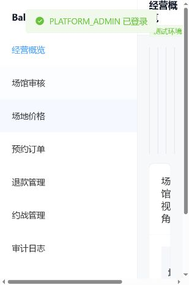
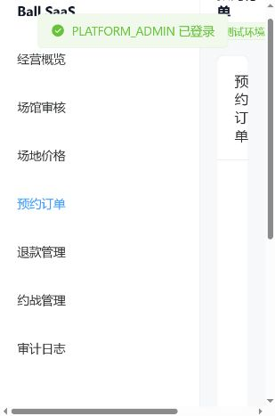
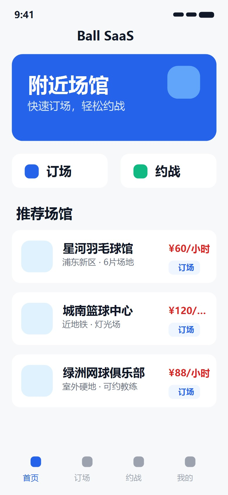
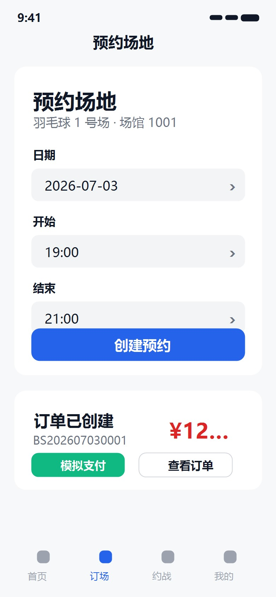
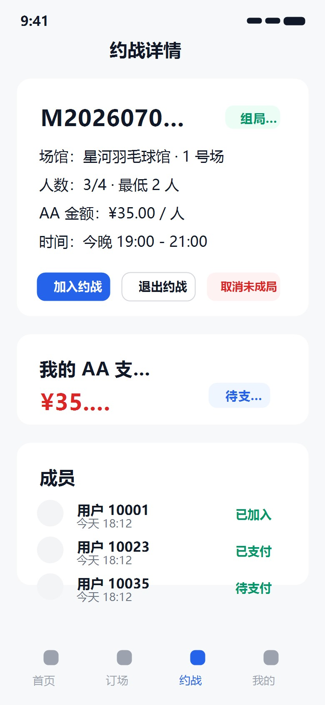

# Ball SaaS 场馆预约与球员约战系统

Ball SaaS 是一个面向运动场馆的预约、订单、退款、球员约战和经营管理系统。项目定位是可支持场馆入驻的 SaaS 平台：平台侧负责场馆审核与运营监管，场馆侧负责场地、价格、订单、退款、核销和报表，用户侧通过微信小程序完成订场、支付、退款和约战。

当前版本已经完成测试环境 P0/P1 核心链路，可用于产品演示、接口联调和后续正式上线改造。演示后台访问已启用 Basic Auth；真实微信支付、正式域名 HTTPS、小程序真机验收和生产级账号体系属于上线前外部条件。

## 项目截图

### 管理后台 - 经营概览



### 管理后台 - 预约订单



### 管理后台 - 审计日志


### 小程序 - 首页预览

> 以下为基于小程序源码页面结构生成的预览截图，微信开发者工具/真机截图需在配置 AppID、合法域名后补充。



### 小程序 - 预约场地预览



### 小程序 - 约战详情预览



## 核心功能

### 平台侧

- 场馆入驻审核
- 平台经营概览
- 全局订单、退款、约战数据查看
- 平台审计日志查询
- 结算/分账占位接口

### 场馆侧

- 场地管理
- 价格规则配置
- 预约订单列表与详情
- 订单核销
- 退款列表与详情
- 约战管理
- 场馆经营报表
- 场馆范围审计日志
- 场馆管理员和场馆员工 mock 角色验证

### 小程序侧

- mock 微信登录
- 场馆列表
- 场馆详情
- 可预约场地查询
- 创建预约
- 模拟支付
- 订单列表与详情
- 退款申请
- 约战列表与详情
- 创建约战
- 加入/退出约战
- AA 支付创建与模拟支付
- 我的页面登录态展示

### 后端能力

- PostgreSQL 持久化
- Redis 临时锁场
- Flyway 数据库迁移
- 支付通知幂等
- 退款通知幂等
- 订单超时关闭
- 并发预约防重
- 30 分钟粒度时间槽
- 约战自动成局
- 未成局自动取消与退款记录
- 平台/场馆/用户数据隔离
- 审计日志落库与查询

## 技术架构

```text
微信小程序
   |
   | HTTP API，测试环境为 18200，正式环境需 HTTPS 域名
   v
Spring Boot API  <---- Redis
   |
   v
PostgreSQL

Vue 3 + Element Plus 管理后台
   |
   | Nginx /api 反向代理
   v
Spring Boot API
```

技术选型：

| 模块 | 技术 |
| --- | --- |
| 后端 | Java 21, Spring Boot 3.x, Spring Data JPA, Spring Security, Flyway |
| 数据库 | PostgreSQL 16 |
| 缓存/锁 | Redis 7 |
| 管理后台 | Vue 3, TypeScript, Vite, Element Plus, Axios |
| 小程序 | 微信原生小程序 |
| 部署 | Docker, Docker Compose, Nginx |
| 测试 | JUnit 5, Mockito, PowerShell smoke scripts |

## 目录结构

```text
backend/       Spring Boot API 服务
admin/         Vue 3 + Element Plus 管理后台
miniprogram/   微信原生小程序源码
deploy/        Docker Compose 与部署说明
docs/          产品、架构、需求、测试报告和截图
scripts/       本地测试和服务器冒烟脚本
```

## 本地开发

### 后端测试

项目内置了本地 Java 21 和 Maven 工具链脚本，不要求修改系统 `JAVA_HOME`。

```powershell
.\scripts\backend-test.ps1
```

当前最后一次记录：

```text
Tests run: 35, Failures: 0, Errors: 0, Skipped: 0
```

### 管理后台构建

```powershell
.\scripts\admin-build.ps1
```

或者进入 `admin/` 目录后执行：

```bash
npm install
npm run build
```

### 小程序结构检查

```bash
node -e 'const fs=require("fs"); const path=require("path"); const root="miniprogram"; const app=JSON.parse(fs.readFileSync(path.join(root,"app.json"),"utf8")); let json=1,js=0,pages=0; for (const p of app.pages){ pages++; for (const ext of ["js","json","wxml","wxss"]){ const f=path.join(root,p+"."+ext); if(!fs.existsSync(f)){ throw new Error("missing "+f); } if(ext==="json"){ JSON.parse(fs.readFileSync(f,"utf8")); json++; } if(ext==="js") js++; }} console.log("miniprogram json/js/page-structure check passed. json="+json+", js="+js+", pages="+pages);'
```

## Docker 部署

测试部署默认使用高位端口，不占用服务器 80/443：

```text
API:   18200
Admin: 18201
PostgreSQL: Docker 内部网络
Redis: Docker 内部网络
```

启动：

```bash
cd /path/to/ball-saas
sudo docker compose -f deploy/docker-compose.yml up -d --build
```

查看状态：

```bash
sudo docker compose -f deploy/docker-compose.yml ps
```

健康检查：

```bash
curl http://127.0.0.1:18200/actuator/health
curl http://127.0.0.1:18201/
```

更多部署约束见 [deploy/README.md](deploy/README.md)。

## 测试环境验证脚本

服务器冒烟脚本位于 `scripts/`：

```powershell
.\scripts\server-smoke.ps1
.\scripts\server-match-smoke.ps1
.\scripts\server-match-auto-cancel-smoke.ps1
```

覆盖内容：

- 场馆创建与审核
- 场地与价格规则
- 并发预约同一场地同一时间段只成功 1 个
- 60 分钟订单写 2 个时间槽
- 90 分钟订单写 3 个时间槽
- 全额退款释放时间槽
- 部分退款不释放时间槽
- 报表金额统计
- 约战创建、加入、AA 支付、自动成局
- 未成局取消和退款记录

详细测试记录见 [docs/test-report.md](docs/test-report.md)。

## 小程序上线说明

当前小程序使用测试 API 配置，源码中保留了正式 HTTPS 域名配置位。正式上线前必须完成：

- 备案域名
- HTTPS 证书
- 微信小程序合法域名配置
- 微信支付商户号
- 微信支付 API v3 密钥
- 商户证书/平台证书
- 支付与退款公网 HTTPS 回调地址
- 微信开发者工具预览、编译和真机调试

当前系统已经完成模拟支付/退款闭环，但不能声称真实微信支付/退款已完成。

## 当前限制

- 后台登录当前为开发期 mock token，不是生产级账号系统。
- 生产级员工管理、密码策略、菜单权限仍需上线前补齐。
- 真实微信支付/退款、验签、证书和回调解密未接入。
- 小程序真机测试未执行。
- 当前测试端口为 `18200/18201`，正式小程序必须使用备案域名 + HTTPS。

## 参考文档

- [开发文档](docs/development.md)
- [架构文档](docs/architecture.md)
- [需求编程文档](docs/requirements-programming.md)
- [测试文档](docs/testing.md)
- [测试报告](docs/test-report.md)
- [前端风格文档](docs/frontend-style.md)

## License

当前未指定开源许可证。发布到公开 GitHub 前请根据业务目标选择合适许可证，或保持私有仓库。
